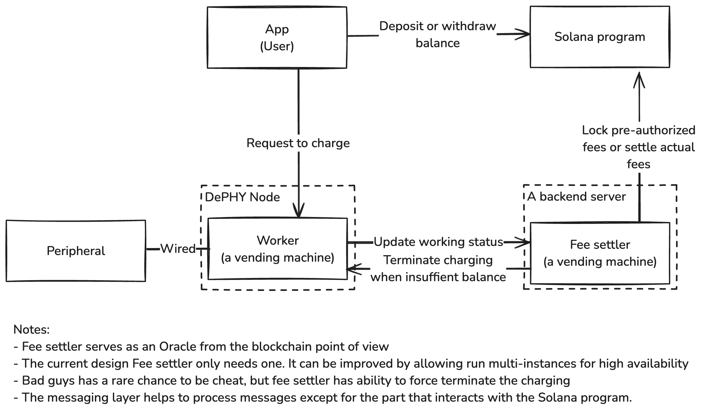

# DePHY vending machine examples

This is a vending machine showcase for DePHY Messaging Layer.

## Online demo

The program has deployed to Solana devnet, address: `GguVKxU88NUe3GLtns7Uaa6a8Pjb9USKq3WD1rjZnPS9`

See <https://balance-payment.pages.dev/program> for the dApp

## How it works

## Repo contents

- [Solana program and dApp](./balance-payment)
  - [dApp](./balance-payment/app)
- [Pre-generated program Rust SDK](./balance-payment-sdk)
- Examples
  - [DeCharge](./examples/decharge-controller)
  - [Gacha](./examples/gacha-controller)

## Run from source

1. Run DePHY vending machine workers by: `docker compose up`
2. [Deploy the Solana program and run the dApp](./balance-payment/README.md)

## TODO

- Build a scripts to quick deploy a local demo
- Rename DeCharge things to vending machine
- Rich docs

## Future works

- Use an offchain account book to ensure the process transactionality
- Indexer and a dashboard dAPP for showing order history

## License

MIT
